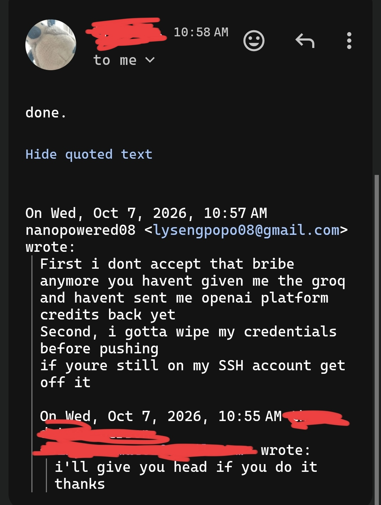

# Terrible Harness? (It's still terrible since it's AI that coded it. Formerly AskGPT, i still refer this project as AskGPT anyways)

<p align="center">
  
</p>

> [!CAUTION]
Note to self: don't let Antigravity near the keys. This project is vibe-coded fully with Antigravity, and provided as-is, meaning you will encounter bugs I would probably fix soon but not if life gets in the way.

## So what the fuck is this?

So it turned from small to big because I wanted an upgrade to the original Bash script, `askgpt.sh`. This now includes:
- Code caused by `/grill-me` in Antigravity
- Tool call fixes
- Whatever

## Thanks to..

- Google, for Gemini.
- Google again, for Antigravity.
- Anthropic, for Claude finding bugs in it and helping as much as it can.
- Anthropic again, for resetting my usage before all of this happened.
- OpenAI, for ChatGPT giving the original idea.
- OpenAI again, for not asking me to start a new chat when my image usage ran out.
- OpenAI, for GPT-OSS and me being able to turn it into a [tsundere](https://vt.tiktok.com/ZSbVQ1W3q/)
- High-Flyer, for DeepSeek.
- High-Flyer again, for DeepSeek's original `askgpt.sh` draft.

## How do I even use this!?

It's a CLI, idiot.
Build it first

#### BUT HOW DO I BUILD IT!?

Not that you should know, but you can always run `npm run`.

Eitherway I'm obligated to tell you how, so:

```bash
npm i
npm run build
npm link
```

#### HOW DO I RUN IT THEN?

If you already ran `npm link`, then just `askgpt`. (pun intended)

#### BUT YOU- YOU DIDN'T TELL ME THE ARGUMENTS TO IT!

It doesn't need any.
If you're considering reading the original AI version of this README.md, go to the first commit with 7986f1be.

#### There are some bugs? Really?

Yes there are.

#### What are they?

Let's see in this box:
- The model spends all of it's tool calls in some cases. Why? Because it can. It wants to burn through your credits.
- You have to SPECIFY the model. For example, if you're using Groq, you have to use this format: (company name, eg openai)/(model name, eg gpt-oss-120b)

#### Anything else to say?

"I- I didn't do this because I- I wanted to!! I- I d- did this just b- because you asked!!" -Gemini (3.8 Flash, High Thinking, Antigravity)

### License

MIT. Read more at LICENSE.

### So why tf did you open source this repo in the first place?

Long story short...


