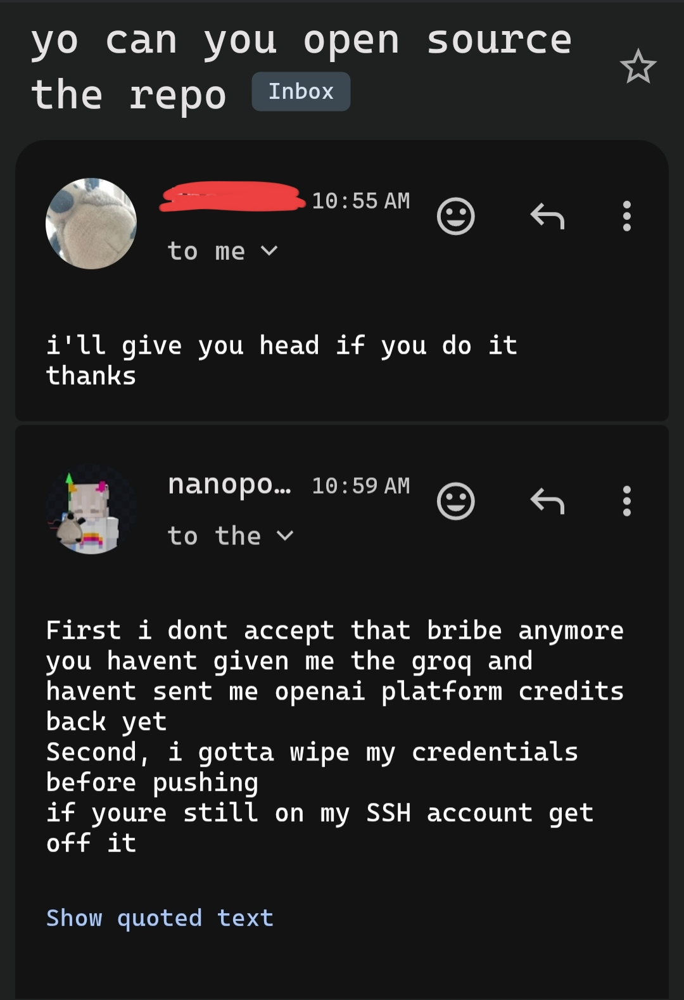

# askgpt

> [!CAUTION]
This project is heavily vibe-coded. Certainly don't let Antigravity near config.json next time.
This is just a simpler version of Antigravity, provided as-is. (with bugs) If the model acts up, it's Gemini's problem.

## So what the fuck is this?

Well it's supposed to be a upgraded version of my original shell script, `askgpt.sh`, alongside coding, tooling, whatever.
Turns out I ran out of my starter quota so we'll see if I push updates sooner.

## Thanks to..

Google, for Gemini.
Google again, for Antigravity.
Anthropic, for Claude finding bugs in it and helping as much as it can.
Anthropic again, for resetting my usage before all of this happened.
OpenAI, for ChatGPT giving the original idea.
OpenAI again, for not asking me to start a new chat when my image usage ran out.
OpenAI, for GPT-OSS and me being able to turn it into a [tsundere](https://vt.tiktok.com/ZSbVQ1W3q/)
High-Flyer, for DeepSeek.
High-Flyer again, for DeepSeek's original `askgpt.sh` draft.

## How do I even use this!?

It's a CLI, idiot.

### Build it.

Just do...

```bash
npm i
npm run build
npm link
```

### Then run it.

You already know what to do.
Just `askgpt`. (pun intended)

### YOU DIDNT SPECIFY HOW I SHOULD RUN IT LIKE!!

Figure it out on your own. If you want to read Antigravity's README.md.
It's at commit 7986f1be50385eae5a4c823768e615bdb4454454.
Or you can use --help aswell.
There's a bug here which I won't fix: you don't type in the model name itself.
You type in (model company)/(model)
For example:
 - openai/gpt-oss-120b
 - qwen/qwen3.8-27b

"I- I didn't do this because I- I wanted to!! I- I d- did this just b- because you asked!!" -Gemini

### License

MIT. Read more at LICENSE.

### So why tf did you open source this repo in the first place?

Long story short...


